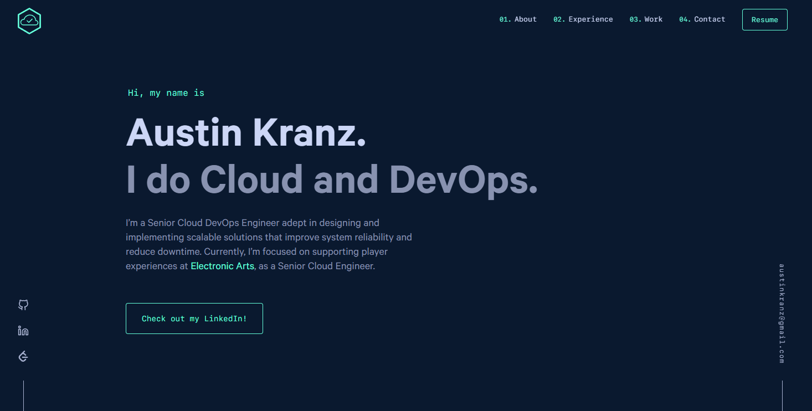

<div align="center">
  
</div>
<h1 align="center">
  austinkranz.com
</h1>
<p align="center">
  Interactive resume <a href="https://austinkranz.com" target="_blank">austinkranz.com</a> built with <a href="https://www.gatsbyjs.org/" target="_blank">Gatsby</a> and hosted with <a href="https://www.firebase.google.com/" target="_blank">Firebase</a>
</p>
<p align="center">
  Original design by <a href="https://brittanychiang.com" target="_blank">brittanychiang.com</a> ~ Forked and customized from: <a href="https://github.com/bchiang7/v4" target="_blank">github.com/bchiang7/v4</a>
</p>
<p align="center">
  <a href="https://firebase.google.com/" target="_blank">
    
  </a>
  <a href="https://nodejs.org/en" target="_blank">
    
  </a>
  <a href="https://react.dev/" target="_blank">
    
  </a>

</p>



## 🚀 Austin Kranz - Interactive Resume

Thank you for visiting the austinkranz.com project. This application was originally designed and developed by Brittany Chiang (<a href="https://brittanychiang.com" target="_blank">brittanychiang.com</a>). I have forked and customized the project for my own implementation.

Brittany has generously made the source code publicly available for others to use and adapt. You can find the original repository at <a href="https://github.com/bchiang7/v4" target="\_blankgithub.com/bchiang7/v4</a>.

## 🛠 Installation & Set Up

1. Install the Gatsby CLI

   ```sh
   npm install -g gatsby-cli
   ```

2. Install and use the correct version of Node using [NVM](https://github.com/nvm-sh/nvm)

   ```sh
   nvm install
   ```

3. Install dependencies

   ```sh
   yarn
   ```

4. Start the development server

   ```sh
   npm start
   ```

## 🚀 Building and Running for Production

1. Generate a full static production build

   ```sh
   npm run build
   ```

1. Preview the site as it will appear once deployed

   ```sh
   npm run serve
   ```

## 🎨 Color Reference

| Color          | Hex                                                                |
| -------------- | ------------------------------------------------------------------ |
| Navy           |  `#0a192f` |
| Light Navy     |  `#112240` |
| Lightest Navy  |  `#233554` |
| Slate          |  `#8892b0` |
| Light Slate    |  `#a8b2d1` |
| Lightest Slate |  `#ccd6f6` |
| White          |  `#e6f1ff` |
| Green          |  `#64ffda` |
